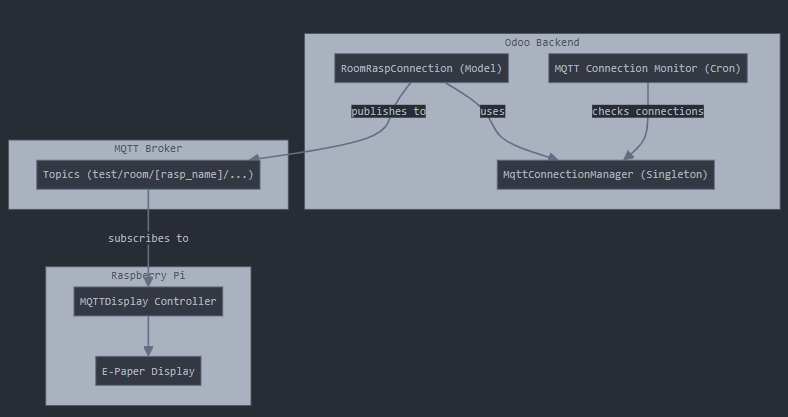
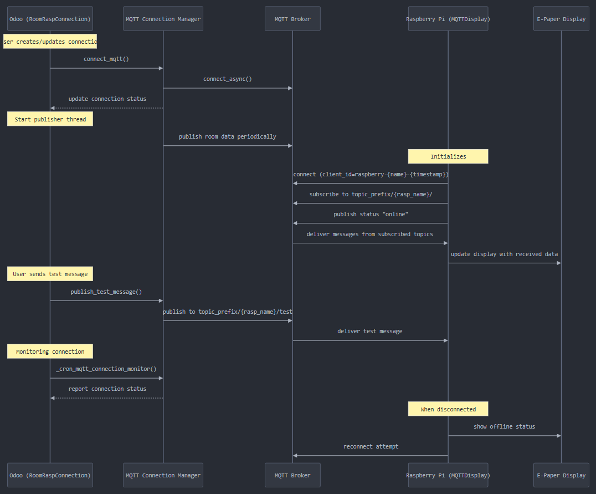

# MQTT Communication System: Odoo to Raspberry Pi E-Paper Display

## Table of Contents
- [Architecture Overview](#architecture-overview)
- [System Components](#system-components)
- [Communication Flow](#communication-flow)
- [Configuration Parameters](#configuration-parameters)
- [Error Handling](#error-handling)
- [Security Considerations](#security-considerations)
- [Extending the System](#extending-the-system)
- [Troubleshooting](#troubleshooting)

## Architecture Overview
This document outlines the MQTT-based communication system between an Odoo backend and Raspberry Pi devices with e-paper displays. The system enables real-time data updates from Odoo to remote displays through a secure MQTT broker.

## System Components

### 1. Odoo Backend
The Odoo Backend (`connection_conf`) manages room/device connections through MQTT.

- **RoomRaspConnection Model**: Manages MQTT connection configurations and status
- **MqttConnectionManager**: Singleton class that handles multiple MQTT connections
- **Periodic Tasks**: Background jobs for connection monitoring and data publishing

#### Key Classes and Methods
- **MqttConnectionManager**: Singleton class that tracks all MQTT connections
  - `register()`: Adds a new MQTT client to the manager
  - `unregister()`: Removes and cleanly disconnects a client
  - `get_client()`: Retrieves an MQTT client instance
  - `is_connected()`: Checks connection status

- **RoomRaspConnection**: Odoo model with MQTT fields and connection methods
  - `connect_mqtt()`: Initiates a new MQTT connection
  - `_mqtt_loop_start()`: Starts the client and event loop
  - `_on_connect()`: Handles successful connections
  - `_on_disconnect()`: Manages disconnections
  - `_reconnect_mqtt()`: Attempts to reconnect when needed
  - `_cron_mqtt_connection_monitor()`: Periodically checks connection status
  - `publish_test_message()`: Sends a test message to verify connectivity

### 2. MQTT Broker
- Acts as the message routing system between Odoo and Raspberry Pi devices
- Supports TLS encryption and authentication
- Handles topic-based message distribution

### 3. Raspberry Pi Devices
The Raspberry Pi Devices (`event_display_script`) display data and subscribe to MQTT topics.

- **MQTTDisplay Controller**: Manages MQTT subscriptions and display updates 
- **E-Paper Display**: Low-power display for showing room/event information
- **Background Threads**: Handle connection monitoring and display updates

#### Key Classes and Methods
- **MQTTDisplay**: Main controller class for the Raspberry Pi
  - `__init__()`: Configures the MQTT client parameters
  - `connect_mqtt()`: Establishes the connection and sets callbacks
  - `on_connect()`: Subscribes to topics and publishes online status
  - `on_disconnect()`: Handles disconnection events
  - `setup_display()`: Initializes the e-paper display
  - `display_room_data()`: Renders data to the e-paper screen

## Communication Flow

### 1. Connection Establishment
- Odoo initiates connection to MQTT broker with configured parameters
- Raspberry Pi connects to broker and subscribes to its specific topics
- Both publish status information (online/offline)

### 2. Data Publishing
- Odoo publishes room/event data periodically to specific topics
- Data is routed through broker to relevant Raspberry Pi devices
- Special messages can be sent for testing or configuration

### 3. Display Updates
- Raspberry Pi receives data from subscribed topics
- Controller processes data and updates e-paper display
- Status information is shown when connections change

### Topic Structure
- Format: `{topic_prefix}{device_name}/[subtopic]`
- Examples:
  - `test/room/reception/status` (device status)
  - `test/room/reception/data` (room data)
  - `test/room/reception/test` (test messages)

### Communication Diagrams

**MQTT Architecture Diagram:**

**MQTT Sequence Diagram:**

## Configuration Parameters

### Odoo MQTT Configuration
- Broker address and port
- Authentication credentials
- Topic prefix
- TLS/SSL settings
- QoS level (0: At most once, 1: At least once, 2: Exactly once)
- Keep-alive interval

### Raspberry Pi Configuration
- Broker address and port
- Device name (for topic subscription)
- Authentication credentials
- Topic prefix
- TLS/SSL settings
- Timezone settings

### Connection Parameters
Both sides have similar connection parameters:
- Broker address
- Port (default 8883 on Odoo, configurable on Pi)
- Username/password
- TLS settings
- Client ID generation
- Keep-alive values

## Error Handling
- Both systems implement reconnection strategies
- Connection status is tracked and displayed
- Error logging helps with troubleshooting
- Fallback display content when connection is lost

### Error Codes
MQTT connection errors are identified by return codes:
- 0: Success
- 1: Incorrect protocol version
- 2: Invalid client identifier
- 3: Server unavailable
- 4: Bad credentials
- 5: Not authorized

## Security Considerations
- TLS encryption for all communications
- Username/password authentication
- Unique client IDs to prevent connection conflicts
- Topic structure limits device access to relevant data only

## Extending the System
The modular design allows for:
- Adding new types of messages/topics
- Supporting additional display types
- Implementing more complex interaction patterns
- Enhanced data visualization on displays

## Troubleshooting

### Common Issues and Solutions
- **Connection failures**: Check network, credentials, and broker availability
- **Message delivery problems**: Verify topic structure and subscription patterns
- **Display not updating**: Check connection status and message processing logic

### Debugging Steps
1. **Check connection status**:
   - On Odoo: Look at `mqtt_connection_state` field on RoomRaspConnection
   - On Pi: Check logs for connection messages
2. **Test connectivity**:
   - Use `test_mqtt_connection()` and `publish_test_message()` methods on Odoo
   - Check if the Raspberry Pi is receiving messages
3. **Extending functionality**:
   - Add new MQTT topics for additional features
   - Enhance the `display_room_data()` method to show more information

---

*Document Version: 1.0*  
*Last Updated: May 19, 2025*