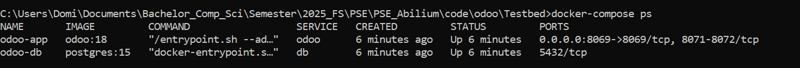

# 1. Navigate to your directory
Ensure you are in the folder where your docker-compose.yaml is located.
```
cd /path/to/your/docker-compose-directory
```

# 2. Start the Services
Run the following command to start the services in detached mode (-d runs in the background):

```
docker-compose up -d
```

# 3. Check Running Containers
Verify that both odoo-app and odoo-db containers are running:

```
docker ps
```

You should get something that looks as follows:



# 4. Open Odoo In Browser
As you would do otherwise, you can now go to any browser of your choice and open odoo in browserview by typing in the URL:
```
localhost:8069
```

You might get prompted to create a new database. Make sure to remember the masterpassword for this!

# 4. Overview Of Docker Commands

## View Logs
To troubleshoot any issues, check the logs:

```
docker-compose logs -f
```

To exit the logs, enter one of the following commands:
- CTRL + C → Stops the log output and returns to the terminal.

- CTRL + Z → Suspends the process (but doesn’t stop the service).

- Press q → Works in some cases if the log output is paginated.

## Stop the Containers (Graceful Shutdown)
```
docker-compose stop
```

This stops the running containers without removing them.

## Restart the Containers
```
docker-compose restart
```

This stops and starts the containers.

## Stop and Remove Containers
```
docker-compose down
```

This stops and removes all containers, networks, and volumes created by the docker-compose.yaml.